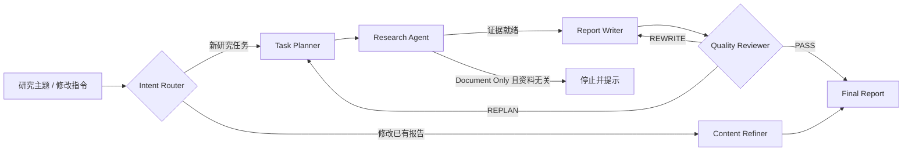
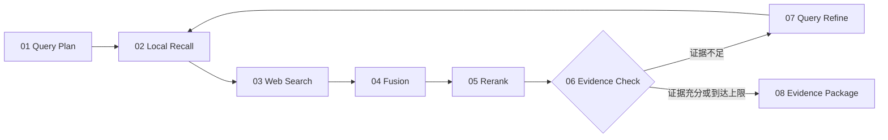
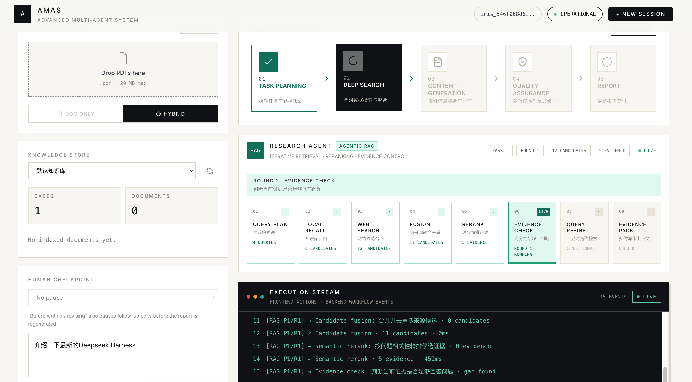
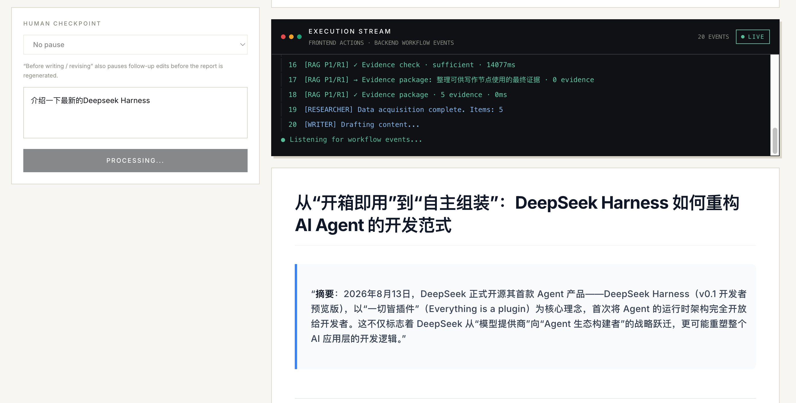
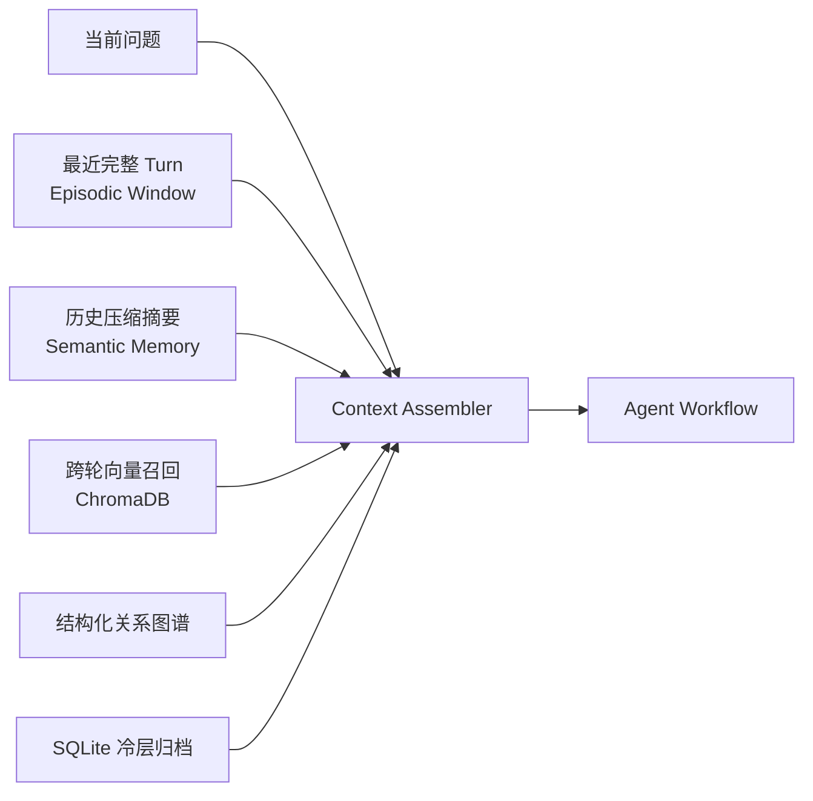

<div align="center">

# AMAS

### Advanced Multi-Agent System

**面向深度调研、证据检索与高质量报告生成的可观测多智能体系统**

AMAS 将任务规划、Agentic RAG、内容生成、质量审查和多轮修改组织为一条可追踪、可暂停、可恢复的研究工作流。

[](https://www.python.org/)
[](https://langchain-ai.github.io/langgraph/)
[](https://fastapi.tiangolo.com/)
[](https://vuejs.org/)
[](https://redis.io/)
[](https://docs.docker.com/compose/)

[核心能力](#features) · [工作原理](#workflow) · [界面预览](#preview) · [快速开始](#quick-start) · [项目结构](#project-structure)

</div>

---

## 📖 项目简介

AMAS 不是一次性调用大模型的聊天页面，而是一套围绕「研究任务」构建的多智能体执行系统。用户可以上传 PDF、选择仅文档或混合检索模式、设置写作前人工检查点，然后观察任务如何经过规划、检索、证据筛选、写作和审查，最终得到结构化研究报告。

系统特别强调两个目标：

- **研究过程可见**：不仅展示主 Agent 到了哪个节点，还会展开 Research Agent 内部的 Agentic RAG 子流程、候选数量、证据数量、迭代轮次与耗时。
- **结果生成可控**：支持 Document Only / Hybrid 检索策略、写作前暂停、多轮追问与报告定向改写，并通过 Reviewer 形成质量闭环。

---

<a id="features"></a>

## ✨ 核心能力

| 能力 | 当前实现 |
| --- | --- |
| **多智能体研究闭环** | Planner → Research Agent → Writer → Reviewer → Report；Reviewer 可触发重新规划或重写 |
| **Agentic RAG** | 查询规划、本地召回、网络搜索、候选融合、语义重排、证据充分性检查、查询改写与证据打包 |
| **混合检索** | PDF / ChromaDB 稠密召回 + BM25 稀疏召回 + Tavily Web Search |
| **证据控制** | 跨来源去重、Cross-Encoder 重排、证据缺口识别与最多两轮迭代检索 |
| **过程可观测** | 主工作流、RAG 子流程、Execution Stream、Pass / Round / Candidate / Evidence 指标实时展示 |
| **Human-in-the-loop** | 可在首次写作或后续报告改写前暂停，注入人工要求后从 LangGraph checkpoint 继续 |
| **多轮会话** | 持久化 Session / Turn，支持上下文窗口、历史摘要、跨轮语义召回与报告定向修改 |
| **分层记忆** | Redis 热记忆、Chroma 跨轮语义记忆、SQLite 冷记忆与结构化关系图谱 |
| **知识库管理** | PDF 上传、知识库隔离、文档统计、刷新与上下文清理 |
| **流式体验** | FastAPI SSE 推送节点事件和自定义 RAG 事件，前端实时渲染 Markdown、链接与 KaTeX 公式 |
| **运行可靠性** | SQLite checkpoint、节点级超时/重试、工具注册与执行封装、请求级错误信息、速率限制和上传校验 |

---

<a id="workflow"></a>

## 🧭 工作原理

### 主工作流



1. **Intent Router** 判断本轮是新研究任务，还是针对已有报告的跟进修改。
2. **Task Planner** 将问题拆成多个可检索、可写作的子任务。
3. **Research Agent** 运行独立的 Agentic RAG 子图，构建经过重排和充分性检查的证据包。
4. **Report Writer** 融合任务计划、证据和会话记忆，生成结构化 Markdown 报告。
5. **Quality Reviewer** 检查内容质量，决定通过、重新规划或重写。
6. **Content Refiner** 在后续轮次中直接理解修改指令，对既有报告进行定向更新。

### Research Agent：8 阶段 Agentic RAG

Research Agent 不是单次 `search()` 调用，而是一个带状态、条件分支和迭代能力的 LangGraph 子图：



| 阶段 | 作用 |
| --- | --- |
| **01 Query Plan** | 根据用户问题、Planner 计划和历史检索提示生成本轮查询 |
| **02 Local Recall** | 从当前知识库召回 PDF 片段，融合稠密向量和 BM25 关键词结果 |
| **03 Web Search** | Hybrid 模式下通过 Tavily 获取网络候选；Document Only 模式跳过 |
| **04 Fusion** | 统一本地与网络候选结构，按来源和内容去重 |
| **05 Rerank** | 使用 Cross-Encoder 按问题相关性重新排序并选出核心证据 |
| **06 Evidence Check** | 判断证据能否充分回答问题，并生成 coverage gap |
| **07 Query Refine** | 证据不足时根据缺口生成补充查询，进入下一轮检索 |
| **08 Evidence Package** | 将最终证据整理为 Writer 可直接消费的写作上下文 |

前端会接收每个阶段的 `running / completed / failed` 事件，展示当前 Pass、Round、候选数、证据数、阶段耗时以及证据缺口。默认最多执行两轮检索，避免无限循环。

### 检索模式

| 模式 | 行为 |
| --- | --- |
| **Document Only** | 只使用当前知识库。若文档与问题无关，工作流会停止并明确提示，不使用网络内容补写 |
| **Hybrid** | 同时使用本地知识库和 Web Search；即使本地没有文档，也能以纯网络检索方式完成研究 |

---

## 🖥️ 前端工作台

新版前端将输入、知识库、人工检查点、执行过程和报告放在同一研究工作台中：

- **Workflow Engine**：横向展示 Task Planning、Deep Search、Content Generation、Quality Assurance 和 Report 五个主阶段。
- **Research Agent 面板**：展开 Agentic RAG 的 8 个内部步骤，并显示 Pass、Round、Candidates、Evidence 和实时状态。
- **Execution Stream**：统一输出前端动作、后端节点事件、RAG 子流程事件、警告与错误，方便定位任务当前所在位置。
- **Knowledge Store**：选择知识库、刷新文档列表，并查看知识库和文档数量。
- **Human Checkpoint**：选择 `Before writing / revising` 后，首次写作和后续 Refiner 改写都会在生成报告前暂停。
- **Report View**：接收 SSE 结果后以打字机效果呈现报告，支持 Markdown、外链和数学公式。
- **Session Control**：显示当前会话状态、轮次与 Token 预算，并支持创建新会话。

---

<a id="preview"></a>

## 🎬 界面预览

### 首页与研究工作台

首页包含 PDF 上传、检索模式、研究主题、总工作流和报告区域。

<p align="center">
  
</p>

### Agentic RAG 与执行效果

Research Agent 会逐步展示检索、融合、重排和证据检查过程；下方 Execution Stream 同步输出后端工作流事件。

<p align="center">
  
</p>

---

## 🧠 会话与分层记忆

AMAS 会为每次研究分配 Session 和 Turn，并在下一轮请求前重新装配相关上下文：



- **近期完整记忆**：Redis 保存最近 Turn 的问题、计划、证据、报告和审查状态。
- **历史语义记忆**：超出滑动窗口的内容会被压缩成摘要，并支持跨轮语义召回。
- **冷层与图谱**：长期未访问记忆可归档到 SQLite；结构化抽取记录用户偏好、实体和关系。
- **自动升温与维护**：冷层或图谱命中后可重新进入活跃上下文，后台维护任务负责归档、遗忘和知识抽取。
- **预算感知**：记录会话与单轮 Token 使用量，在上下文变长时通过压缩控制预算。

---

## 🏗️ 技术架构

| 层级 | 主要技术 | 职责 |
| --- | --- | --- |
| **交互层** | Vue 3、Tailwind CSS、Vite、Markdown-it、KaTeX | 研究输入、流程可视化、执行流和报告渲染 |
| **API 层** | FastAPI、Pydantic、SSE | 对话、恢复、会话、知识库、文件上传和流式事件 |
| **工作流层** | LangGraph、AsyncSqliteSaver | Agent 编排、条件路由、循环修订、checkpoint 与 HITL |
| **Agent 层** | Planner、Researcher、Writer、Reviewer、Refiner | 规划、检索、写作、审查和定向修改 |
| **检索层** | ChromaDB、DashScope Embeddings、BM25、Cross-Encoder、Tavily | 本地/网络召回、融合、重排和证据控制 |
| **上下文层** | Redis、ChromaDB、SQLite | 会话、Turn、跨轮召回、冷记忆与关系图谱 |
| **运行时层** | Tool Registry、超时/重试、Token Ledger、Rate Limiter | 工具执行、错误隔离、预算和服务保护 |

### Checkpoint 与人工恢复

- 主工作流和 Research Agent 子图均使用 LangGraph 状态管理。
- 主流程 checkpoint 存储在 SQLite，可通过相同 `thread_id` 恢复。
- `POST /api/chat` 可通过 `hitl_pause_before=writer` 在写作前触发中断。
- `POST /api/chat/resume` 接收 `human_input`，从中断点继续执行。
- 「Before writing / revising」同时覆盖 Writer 和 Refiner，后续报告修改不会绕过人工检查点。

---

<a id="quick-start"></a>

## 🚀 快速开始

### 环境要求

- Docker 与 Docker Compose（推荐）
- 或 Python 3.10+、Node.js 22+、Redis
- OpenAI 兼容的聊天模型服务
- DashScope API Key（文本向量化）
- Tavily API Key（Hybrid / 纯网络搜索）

### 使用 Docker Compose

```bash
git clone https://github.com/aweg75006-maker/AMAS.git
cd AMAS

cp .env.example backend/.env
```

编辑 `backend/.env`，至少填写：

```dotenv
# OpenAI 兼容接口；官方 OpenAI 接口可留空 OPENAI_API_BASE
OPENAI_API_BASE=https://your-compatible-endpoint/v1
OPENAI_API_KEY=your-api-key

# PDF 向量化与网络检索
DASHSCOPE_API_KEY=your-dashscope-api-key
TAVILY_API_KEY=your-tavily-api-key
```

如果兼容服务使用不同模型名，还可以覆盖：

```dotenv
LLM_FAST_MODEL=qwen3-max
LLM_SMART_MODEL=deepseek-r1
```

启动服务：

```bash
docker compose up --build
```

| 服务 | 地址 |
| --- | --- |
| 前端 | [http://localhost:5173](http://localhost:5173) |
| 后端 API | [http://localhost:8000](http://localhost:8000) |
| API 文档 | [http://localhost:8000/docs](http://localhost:8000/docs) |
| 健康检查 | [http://localhost:8000/api/health](http://localhost:8000/api/health) |

### 本地开发

先启动 Redis：

```bash
docker compose up -d redis
```

准备并启动后端。已有 Conda `py312` 环境时可以直接复用：

```bash
cp .env.example backend/.env
# 本地运行后端时，将 backend/.env 中的 REDIS_URL 改为：
# REDIS_URL=redis://localhost:6379/0

cd backend
conda activate py312
pip install -r requirements.txt
uvicorn main:app --reload --host 0.0.0.0 --port 8000
```

另开终端启动前端：

```bash
cd frontend
npm install
npm run dev
```

---

## ⚙️ 关键配置

| 环境变量 | 默认值 | 用途 |
| --- | --- | --- |
| `OPENAI_API_BASE` | 空 | OpenAI 兼容接口地址 |
| `OPENAI_API_KEY` | 空 | Planner、Writer、Reviewer、Refiner 与证据判断 |
| `LLM_FAST_MODEL` | `qwen3-max` | 规划、写作等常规模型调用 |
| `LLM_SMART_MODEL` | `deepseek-r1` | 复杂推理模型调用 |
| `DASHSCOPE_API_KEY` | 空 | `text-embedding-v4` 文本向量化 |
| `TAVILY_API_KEY` | 空 | Hybrid 与纯 Web Search |
| `REDIS_URL` | `redis://localhost:6379/0` | 会话、知识库元数据、速率限制与热记忆 |
| `TOTAL_TOKEN_BUDGET` | `128000` | 单会话总 Token 预算 |
| `RAG_MAX_RETRIEVAL_ITERATIONS` | `2` | Agentic RAG 最大检索轮次 |
| `RAG_BM25_ENABLED` | `true` | 是否启用关键词稀疏召回 |
| `MEMORY_ENABLED` | `true` | 是否启用冷层、图谱和多级记忆检索 |
| `MEMORY_WARM_DAYS` | `10` | 热记忆转入冷层前的时间窗 |
| `MEMORY_COLD_RETENTION_DAYS` | `30` | 冷记忆默认保留时间 |
| `WORKFLOW_NODE_TIMEOUT_SECONDS` | `120` | 单节点执行超时 |
| `WORKFLOW_NODE_MAX_RETRIES` | `1` | 单节点最大重试次数 |
| `UPLOAD_MAX_FILES` | `5` | 单次最多上传 PDF 数量 |
| `UPLOAD_MAX_FILE_SIZE_BYTES` | `20971520` | 单文件最大 20 MB |

完整默认值见 [backend/app/core/config.py](backend/app/core/config.py) 和 [.env.example](.env.example)。

---

## 🔌 主要 API

| 方法 | 路径 | 说明 |
| --- | --- | --- |
| `POST` | `/api/chat` | 发起研究并通过 SSE 返回主流程与 RAG 事件 |
| `POST` | `/api/chat/resume` | 向 HITL checkpoint 注入人工输入并继续 |
| `POST` | `/api/upload` | 上传 PDF 并写入指定知识库 |
| `POST` | `/api/clear` | 清理指定知识库上下文 |
| `GET/POST` | `/api/knowledge-bases` | 查询或创建知识库 |
| `GET` | `/api/knowledge-bases/{id}/documents` | 查询知识库文档 |
| `POST` | `/api/sessions` | 创建新会话 |
| `GET` | `/api/sessions/{id}` | 查询会话状态与预算 |
| `GET` | `/api/sessions/{id}/history` | 查询分层会话历史 |
| `GET` | `/api/health` | 服务及元数据后端健康检查 |

请求与响应结构可在服务启动后访问 [/docs](http://localhost:8000/docs) 查看。

---

<a id="project-structure"></a>

## 📂 项目结构

```text
AMAS/
├── backend/
│   ├── app/
│   │   ├── api/                 # FastAPI 路由、SSE、会话与知识库接口
│   │   ├── graph/
│   │   │   ├── nodes/           # Planner / Researcher / Writer / Reviewer / Refiner
│   │   │   ├── policies/        # 检索策略与工作流循环策略
│   │   │   ├── graph.py         # LangGraph 主流程
│   │   │   └── runtime.py       # HITL、节点超时与重试
│   │   ├── harness/             # 节点清单、Prompt 与运行参数
│   │   ├── rag/                 # ChromaDB、BM25、Embedding 与 Reranker
│   │   ├── tools/               # Tool Registry、Runtime 与搜索工具
│   │   ├── repositories/        # Redis 会话和知识库数据访问
│   │   ├── services/            # 历史、知识库、限流与运行时服务
│   │   └── utils/
│   │       └── memory/           # 冷记忆、图谱、检索和生命周期维护
│   └── tests/                   # 后端回归测试
├── frontend/
│   └── src/
│       ├── components/
│       │   ├── WorkflowChain.vue
│       │   └── ResearchProcess.vue
│       ├── services/api.js       # SSE 与 REST API 客户端
│       └── App.vue               # 研究工作台
├── docs/                         # 截图、Docker 与记忆系统文档
└── docker-compose.yml            # 前端、后端与 Redis 编排
```

---

## 🧪 开发与验证

后端测试：

```bash
cd backend
conda run -n py312 python -m pytest -q
```

前端生产构建：

```bash
cd frontend
npm run build
```

提交代码前建议同时执行：

```bash
git diff --check
```

开发文档：[Docker 本地开发](docs/DOCKER_DEV.md)

---

<div align="center">

**AMAS · Make deep research observable, controllable and repeatable.**

</div>
