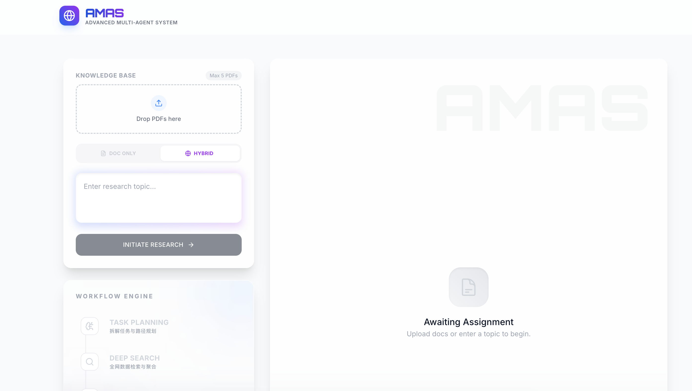
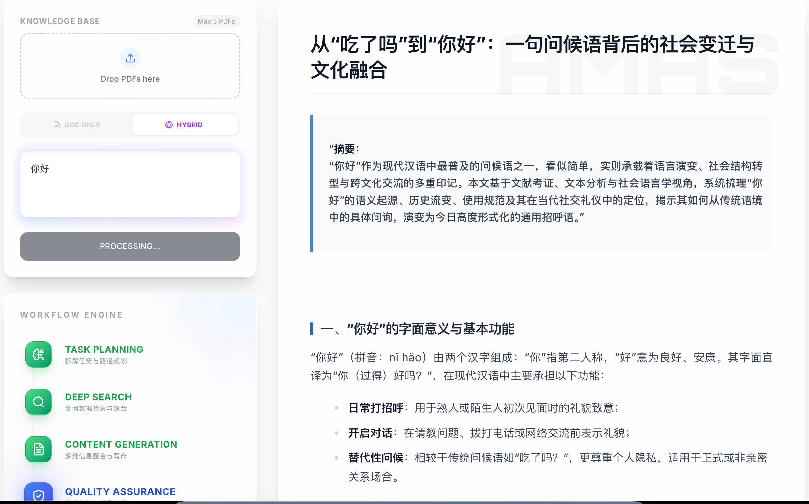
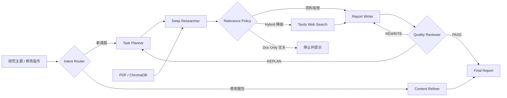

<div align="center">

# 🌐 AMAS

### Advanced Multi-Agent System

**面向深度调研与报告生成的智能体工作流系统**

从意图识别、任务规划、知识检索到内容撰写、质量审查与定向优化，完成可追踪、可回滚的研究闭环。

[](https://www.python.org/)
[](https://fastapi.tiangolo.com/)
[](https://vuejs.org/)
[](https://vite.dev/)
[](https://tailwindcss.com/)
[](https://docs.docker.com/compose/)

[在线体验](https://www.iflowcc.xyz/) · [功能特性](#features) · [界面预览](#preview) · [系统架构](#architecture) · [快速开始](#quick-start)

</div>

---

<a id="features"></a>

## ✨ 功能特性

### 🧠 多智能体研究闭环

- **意图路由**：自动区分新研究任务与基于既有报告的定向修改。
- **任务规划**：将复杂主题拆解为可执行的检索与写作路径。
- **深度研究**：支持本地知识库、全网搜索以及两者结合的 Hybrid 模式。
- **内容生成**：聚合多源信息，生成结构化 Markdown 研究报告。
- **质量审查**：Reviewer 对证据、结构与表达进行检查，并决定通过、重新规划或重写。
- **局部优化**：无需重跑完整流程，即可针对已有报告继续追问和修改。

### 📚 知识库与检索

- **PDF 知识库**：支持批量上传、切分、向量化和知识库隔离。
- **相关性裁判**：检索后先判断文档相关性，降低无关上下文对生成结果的干扰。
- **智能降级**：纯文档模式在资料不相关时及时停止；Hybrid 模式可自动转向网络搜索。
- **跨轮上下文**：通过会话摘要、滑动窗口与向量检索管理长对话上下文。

### 🛡️ 工程化运行能力

- **显式工作流引擎**：默认使用可测试的 Python Workflow Engine，保留 LangGraph legacy fallback。
- **可靠工具运行时**：为 RAG、相关性判断和 Web Search 提供超时、重试与执行追踪。
- **全链路可观测**：持久化 workflow run、节点、工具、路由决策和错误事件。
- **企业基础能力**：集成 JWT 认证、RBAC 权限、审计日志、限流与多租户数据边界。
- **实时反馈**：FastAPI + SSE 持续推送节点状态与报告内容，前端即时呈现执行进度。

### 🔁 运行韧性与人工介入（Checkpoint / HITL）

- **断点续跑（Checkpoint / Resume）**：每个节点执行前在 Redis 落盘完整状态与下一执行节点；运行被取消、崩溃或超时后，可依据 `thread_id` 从最近断点恢复，**无需重跑已完成节点**。
- **人机交互（HITL）**：支持在指定节点前主动暂停（如 `reviewer` 前等待人工确认/修订报告草稿），运行标记为 `PAUSED` 并下发暂停信号；人工输入通过 `/chat/resume` 的 `human_input` 注入断点状态后续跑。
- **恢复接口**：
  - `POST /chat/resume`：`{ "thread_id", "resume_instruction?", "human_input?" }` —— 从断点恢复，可追加补充指令或人工输入。
  - `POST /chat` 支持 `hitl_pause_before` 字段，声明需要在哪个节点前暂停等待人工介入。

### 🔔 被动触发（Webhook + Cron）

研究任务不仅能在对话中发起，也能由外部系统或定时器自动驱动，完成后推送飞书通知。

- **Webhook 被动触发**：外部系统（如飞书事件、CI、监控告警）携带令牌调用 `POST /api/triggers/webhook` 即可触发一次研究；请求立即返回 `accepted`，研究在后台执行，结果（默认）通过飞书自定义机器人推送卡片。
  - 请求体：`{ "token", "query", "search_mode?", "session_id?", "knowledge_base_id?", "notify?", "notify_webhook_url?", "tenant_id?", "user_id?" }`
  - 令牌校验：服务端配置 `WEBHOOK_TRIGGER_TOKEN`，未配置返回 `503`；令牌不符返回 `401`。
- **Cron 定时调度**：通过 `POST /api/triggers/cron/jobs` 注册定时研究任务，支持三种调度：
  - `{"type":"interval","seconds":3600}` 每 N 秒
  - `{"type":"daily","hour":9,"minute":0}` 每天本地时区 H:M
  - `{"type":"cron","expr":"0 9 * * *"}` 标准 5 段 crontab（支持 `*` / `,` / `-` / `*/n`）
  - 任务持久化到 Redis（key：`trigger:cron_job:{id}`，Redis 不可用时降级内存），后台循环按 `CRON_POLL_INTERVAL_SECONDS` 轮询到期任务并异步执行 + 飞书通知。
  - 管理接口：`GET/POST /api/triggers/cron/jobs`、`GET/PATCH/DELETE /api/triggers/cron/jobs/{id}`、`POST /api/triggers/cron/jobs/{id}/run`（立即执行一次，便于调试）。
- **飞书通知**：`app/integrations/feishu.py` 的 `FeishuNotifier` 向自定义机器人 webhook 推送文本/消息卡片，best-effort（失败仅记日志，不阻断主流程）；webhook 通过 `FEISHU_WEBHOOK_URL` 配置。
- **配置项**（backend/.env）：`FEISHU_WEBHOOK_URL`、`WEBHOOK_TRIGGER_TOKEN`、`CRON_ENABLED`、`CRON_POLL_INTERVAL_SECONDS`、`CRON_JOBS`（可选，启动预置任务 JSON 数组）。

### 🧩 第三方 Agent Connector 框架（P5）

把「第三方智能体 / 服务端点」抽象为可插拔的 Connector，让 IRIS 能像调用工具一样
把子问题**委派给外部 Agent**（agent-to-agent 编排），或把子任务交给本系统内部的子 Agent。
设计沿用已有的 `ToolRegistry` 模式，但 Connector 面向更高层的「智能体能力」。

- **统一抽象**：`app/connectors/base.py` 的 `BaseConnector`（协程 `invoke` + 同步 `run` 桥接）。
  `connector.run(prompt, context=..., system_prompt=...)` → 返回结构化 `ConnectorResult`（含 success / error / meta），
  失败统一降级为可读错误文本，不中断主流程。
- **注册中心**：`app/connectors/registry.py` 的 `ConnectorRegistry` + 进程级单例 `get_connector_registry()`。
- **内置实现**：
  - `internal_subagent`（默认可用）：用 IRIS 自身 LLM（`get_llm`）充当子 Agent 处理子问题。
  - `HttpAgentConnector`：调用外部 Agent 端点，支持 `openai_compatible`（`{base_url}/chat/completions`）与 `generic_json` 两种协议，基于 `httpx`，best-effort。
- **配置驱动注册**：在 backend/.env 配置 `CONNECTORS`（JSON 数组）即可注册外部端点，无需改代码：
  ```json
  CONNECTORS=[{"name":"my_agent","type":"http_agent","config":{"base_url":"https://agent.example.com","api_key":"sk-xxx","model":"gpt-4o-mini"}}]
  ```
  支持类型：`http_agent` / `openai_compatible`（别名）/ `internal_subagent`。
- **接入研究工作流**：已注册为研究工具 `delegate_to_connector`（挂在 `researcher` 节点），
  Researcher 可在研究中把子问题委派给任意已注册 Connector 并回收结果：
  - 工具入参：`{ "connector": "internal_subagent", "prompt": "...", "system_prompt": "..." }`
- **测试**：`tests/test_connectors.py`（注册中心 / 配置路由 / HTTP Connector / 内部子 Agent / 工具桥接与降级，13 用例全绿）。

---

<a id="preview"></a>

## 🎬 界面预览

### 研究工作台

上传知识文档、选择检索模式并输入研究主题；左侧工作流会实时展示当前执行阶段。

<p align="center">
  
</p>

### 报告生成

报告以流式方式输出，工作流状态与正文同步更新，支持在同一会话中继续迭代。

<p align="center">
  
</p>

---

<a id="architecture"></a>

## 🏗️ 系统架构



| 层级 | 主要技术 | 职责 |
| --- | --- | --- |
| **交互层** | Vue 3、Tailwind CSS、Vite | 研究输入、知识库管理、工作流状态与报告渲染 |
| **API 层** | FastAPI、SSE、Pydantic | 认证、会话、上传、流式响应与运行时查询 |
| **Agent 层** | Python Workflow Engine、LangGraph fallback | 路由、规划、研究、撰写、审查与优化 |
| **工具层** | Tool Registry、Tool Runtime、Tavily | 工具注册、超时重试、网络检索与调用追踪 |
| **知识层** | ChromaDB、DashScope Embeddings | PDF 切分、向量索引、语义检索与跨轮召回 |
| **数据层** | Redis、PostgreSQL | 会话缓存、知识元数据、审计与工作流记录 |

---

<a id="quick-start"></a>

## 🚀 快速开始

### 环境要求

- Docker 与 Docker Compose（推荐）
- 或 Python 3.10+、Node.js 22+、Redis、PostgreSQL
- 可用的 OpenAI 兼容模型服务、DashScope Embedding 与 Tavily API Key

### Docker Compose 启动

```bash
git clone https://github.com/aweg75006-maker/AMAS.git
cd AMAS

cp .env.example backend/.env
```

编辑 `backend/.env`，至少配置以下模型与检索参数：

```dotenv
# OpenAI 兼容接口；使用 OpenAI 官方接口时可留空 API_BASE
OPENAI_API_BASE=https://your-openai-compatible-endpoint/v1
OPENAI_API_KEY=your-api-key

# PDF 向量化与网络检索
DASHSCOPE_API_KEY=your-dashscope-api-key
TAVILY_API_KEY=your-tavily-api-key

# 生产环境请务必替换
JWT_SECRET_KEY=replace-with-a-long-random-secret
```

启动全部服务：

```bash
docker compose up --build
```

| 服务 | 地址 |
| --- | --- |
| 前端 | [http://localhost:5173](http://localhost:5173) |
| 后端 API | [http://localhost:8000](http://localhost:8000) |
| API 文档 | [http://localhost:8000/docs](http://localhost:8000/docs) |

> 本地首次体验登录功能时，可在 `backend/.env` 中设置 `SEED_DEFAULT_USER_ENABLED=true`，并配置 `SEED_DEFAULT_USERNAME` 与 `SEED_DEFAULT_PASSWORD`。不要提交真实密钥或密码。

### 本地开发

先启动基础服务：

```bash
docker compose up -d redis postgres
```

启动后端：

```bash
cd backend
python -m venv .venv
source .venv/bin/activate
pip install -r requirements.txt
uvicorn main:app --reload --host 0.0.0.0 --port 8000
```

启动前端：

```bash
cd frontend
npm install
npm run dev
```

---

## ⚙️ 关键配置

| 环境变量 | 是否必需 | 默认值 / 用途 |
| --- | :---: | --- |
| `OPENAI_API_BASE` | 视服务而定 | OpenAI 兼容接口地址 |
| `OPENAI_API_KEY` | 是 | Planner、Writer、Reviewer 等模型调用 |
| `DASHSCOPE_API_KEY` | 是 | `text-embedding-v4` 文本向量化 |
| `TAVILY_API_KEY` | Hybrid 模式需要 | 全网搜索 |
| `WORKFLOW_ENGINE` | 否 | 固定使用 `langgraph` |
| `MULTI_TENANT_ENABLED` | 否 | 默认 `false`，请求统一使用 `default` 租户 |
| `CHAT_HISTORY_BACKEND` | 否 | 默认 `memory`；设为 `postgres` 启用持久化历史 |
| `KNOWLEDGE_METADATA_BACKEND` | 否 | 默认 `redis`，可切换为 `postgres` |
| `POSTGRES_DSN` | PostgreSQL 模式需要 | PostgreSQL 连接串 |
| `JWT_SECRET_KEY` | 生产环境必需 | JWT 签名密钥 |
| `TOTAL_TOKEN_BUDGET` | 否 | 默认 `128000` |

更多 Docker 开发说明见 [docs/DOCKER_DEV.md](docs/DOCKER_DEV.md)，工作流引擎发布与回滚说明见 [docs/WORKFLOW_ENGINE_ROLLOUT.md](docs/WORKFLOW_ENGINE_ROLLOUT.md)。

---

## 📂 项目结构

```text
AMAS/
├── backend/
│   ├── app/
│   │   ├── api/            # FastAPI 路由、认证与 SSE 流式接口
│   │   ├── graph/          # 工作流引擎、Agent 节点与路由策略
│   │   ├── harness/        # 工作流清单、Prompt 与版本管理
│   │   ├── tools/          # Tool Registry 与 Tool Runtime
│   │   ├── rag/            # PDF 解析、ChromaDB 与语义检索
│   │   ├── repositories/   # 数据访问层
│   │   └── services/       # 账户、知识库、审计与工作流服务
│   ├── migrations/         # Alembic 数据库迁移
│   └── tests/              # 后端测试
├── frontend/
│   └── src/                # Vue 页面、组件与 API 服务
├── docs/                   # 截图与开发文档
└── docker-compose.yml      # 本地完整环境编排
```

---

## 🧪 开发与验证

```bash
# 后端测试
cd backend
pytest -q

# 前端生产构建
cd frontend
npm run build
```

欢迎通过 [Issues](https://github.com/aweg75006-maker/AMAS/issues) 反馈问题或提交改进建议。提交 Pull Request 前，请确保相关测试与前端构建通过。

---

<div align="center">

**AMAS · Make deep research observable, controllable and repeatable.**

</div>
